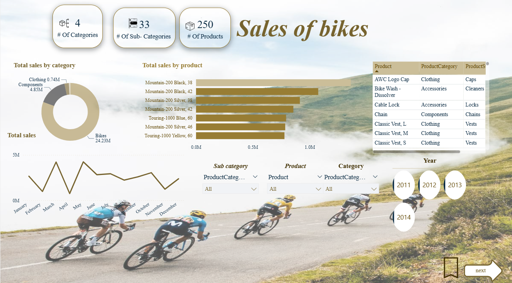

# Bike Sales Dashboard

An interactive Power BI dashboard designed to analyze bike sales performance by category, product, and year. The dashboard provides a clear overview of sales trends, product performance, and category distribution to support better business decision-making.

## Short Description / Purpose

The Bike Sales Dashboard helps users explore sales data in a visual and interactive way. It highlights key metrics such as total product categories, sub-categories, number of products, monthly sales trends, and top-selling bike products.

This dashboard is useful for understanding which product categories generate the highest sales, tracking sales changes over time, and comparing product performance across different years.

## Tech Stack

The dashboard was built using:

- Power BI Desktop – for dashboard design and data visualization
- Power Query – for data cleaning and transformation
- DAX – for calculated measures and KPI cards
- Data Modeling – for connecting tables and enabling filtering
- Excel / CSV Dataset – as the data source

## Dashboard Features / Highlights

- KPI cards showing:
  - Number of Categories
  - Number of Sub-Categories
  - Number of Products

- Donut chart showing total sales by category
- Bar chart showing total sales by product
- Line chart showing monthly sales trends
- Product table for detailed product information
- Interactive slicers for:
  - Category
  - Sub-category
  - Product
  - Year

## Business Problem

Bike sales data can be difficult to understand when it is stored in large tables. Businesses need a simple way to identify top-performing products, compare categories, and monitor sales trends over time.

This dashboard solves that problem by turning raw sales data into clear visuals that support faster and better decisions.

## Key Insights

- Bikes represent the highest sales category compared to other categories.
- Some products such as Mountain-200 and Touring-1000 models show strong sales performance.
- Monthly sales trends help identify changes in customer demand.
- Year filters allow users to compare sales performance from 2011 to 2014.

## Business Impact

This dashboard can help businesses:

- Identify best-selling bike products
- Understand sales trends across months and years
- Compare product categories and sub-categories
- Support inventory and marketing decisions
- Improve reporting using interactive visuals

## Dashboard Preview

## Author

Created by Lana Adil Raboei  
Data Science Student | Power BI | Data Analysis
